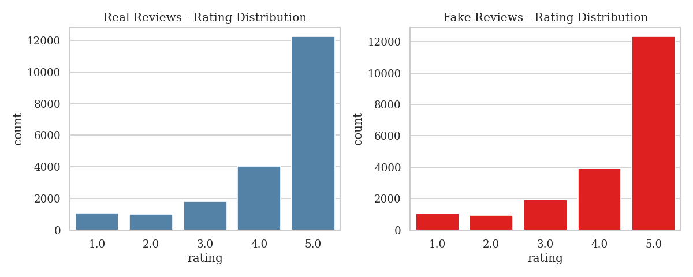
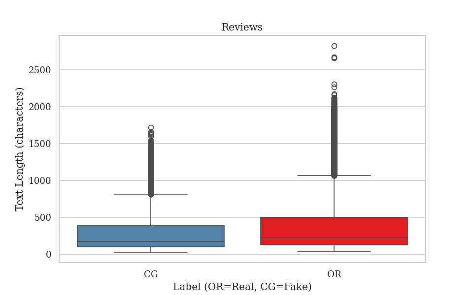
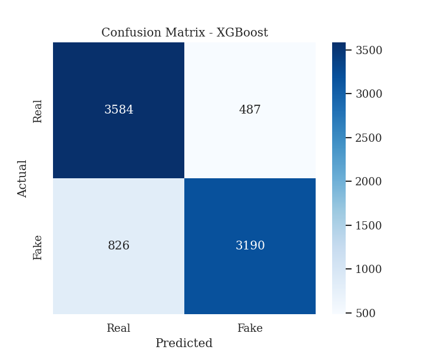

# 🔍 Fake Reviews Detector

NLP and Machine Learning web app to detect fake customer reviews using TF-IDF vectorization and XGBoost classifier, deployed with Streamlit.

---

## 🌐 Live Demo

Run locally with: streamlit run app.py
---

## 📊 Overview

This project builds a fake review detector trained on 40,432 labeled customer reviews. The model analyzes text patterns to distinguish between genuine (OR) and computer-generated fake (CG) reviews.

**Key findings:**
- Real reviews average 397 characters vs 305 for fake ones
- Star ratings alone cannot detect fake reviews — text analysis is essential
- XGBoost achieves 84% accuracy and detects 79% of fake reviews
- Next step: fine-tune BERT in Spanish for restaurant reviews in Extremadura

---

## 🛠️ Tech Stack

- **Python 3**
- **Pandas / NumPy** — data manipulation
- **Matplotlib / Seaborn** — visualizations
- **Scikit-learn** — TF-IDF vectorization and metrics
- **XGBoost** — gradient boosting classifier
- **Streamlit** — web app deployment

---

## 📁 Project Structure
fake-reviews-detector/
├── app.py                        # Streamlit web app
├── fake_reviews_detector.ipynb   # Analysis notebook
├── outputs/                      # Generated visualizations
│   ├── 01_rating_distribution.png
│   ├── 02_text_length.png
│   └── 03_confusion_matrix.png
└── README.md
---

## 📈 Visualizations

### Rating Distribution — Real vs Fake

### Text Length — Real vs Fake

### Confusion Matrix

---

## 📉 Model Results

| Metric | Value |
|--------|-------|
| Accuracy | 84% |
| Precision (Fake) | 87% |
| Recall (Fake) | 79% |
| F1-score (Fake) | 0.83 |
| ROC-AUC | 0.84 |

---

## 🔮 Next Steps

- Fine-tune **BERT in Spanish** for restaurant reviews
- Apply model to **Google Maps reviews from Extremadura, Spain**
- Improve fake detection with additional text features

---

## ⚠️ Limitations

This model was trained on Amazon product reviews in English. Performance may vary on restaurant reviews in Spanish. A BERT-based model fine-tuned in Spanish would significantly improve accuracy for real-world use cases.

---

## 📌 Dataset

This project uses the [Fake Reviews Dataset](https://www.kaggle.com/datasets/muqadasejaz/fake-reviews-dataset) from Kaggle. The raw data file is not included in this repository.

---

## 👤 Author

**Vicente Sánchez Reza**
[github.com/vicentszr](https://github.com/vicentszr)
